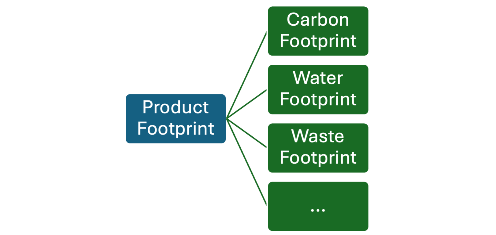

# Cloud for Sustainability WBCSD PACT Conformance F.A.Q.

- *What is WBCSD PACT Conformance?*

  The WBCSD – Partnership for Carbon Transparency (PACT) is an effort to establish standards for the exchange of carbon related data to facilitate the sharing of sustainability data between organizations and improve carbon accounting. The first major standard is a data exchange protocol and data model for exchanging product footprint data.  A solution can become “conformant” to this standard by providing a technical implementation that is tested by the WBCSD and 2 other member organizations for interoperability.

  Solutions that are conformant are listed [here](https://catalog.carbon-transparency.com). 

- *What is the Pathfinder Network?*

  The Pathfinder network is not currently an established network, but rather a “North Star” for PACT where organizations connect and exchange carbon data with each other using open standards. Solutions that are conformant with the specifications are a step in that direction. 

  [Pathfinder Overview](https://www.carbon-transparency.com/media/srhhloun/pathfinder-framework.pdf)

- *What is tested for Conformance with PACT?*

  To date, only the specifications for exchanging Product Carbon Footprint (PCF) between organizations, where one organization is a “host” that can provide PCFs to another organization that is the requesting “client”. This translates into an API specification and a data model for a PCF for exchange, it does not include any testing as to the accuracy or methods for calculating a PCF, only that the PCF that is being exchanged conforms to the data model.

  Here is the specification that is tested for against an implementation.

- *Where can I read more about WBCSD PACT?*

  [PACT Overview](https://www.carbon-transparency.com)

- *What is a Product Footprint?*

  A product footprint is a data format that can be used to encapsulate contextual product specific data, where the context would be carbon, water, waste, etc.  To date, only the Product Carbon Footprint (PCF) has a specification encapsulated within a Product Footprint (PF).

  A complete product footprint would have multiple contexts nested under it:

- *What from Microsoft has passed “conformance testing”?*

  Microsoft, unlike most participants in PACT, provides a cloud platform, developer tools as well as solutions for the industry. We have many partners in our ecosystem that will want to build PACT compliant solutions on the Microsoft cloud.  Microsoft has provided a “sample” implementation and documentation for any customer or partner building a solution for PACT to be able to connect to the “Pathfinder” network.

- *Is this conformant “sample” implementation a complete solution?*

  No, it provides an example and documentation for implementing the data exchange protocol (https://wbcsd.github.io/data-exchange-protocol/v2/) as a “host” solution that can authenticate a “client” and respond to API requests from the “client”.

- *What is in the “sample” implementation?*

  A GitHub repo that provides:
  - An example implementation of the data exchange API that a host would provide to authenticate clients and respond with Product Footprint data.  This example provides a “dotnet” example that can use a customer-based user account directory/database or Microsoft Entra Id.
  - An example “dotnet” client that can authenticate to a host that implements the API and request Product Footprints. An example for creating a Pathfinder “client” connector for use by Sustainability Manager is provided.
  Each example is documented and provides useful development artifacts to accelerate the solution development process for customers and partners to build solutions on the Microsoft Cloud.

- *Does Sustainability Manager use this sample and, thereby conformant?*

  No, Sustainability Manager does not currently use this example to provide an out of the box conformant solution. There are several reasons for this.
  - Sustainability manager is NOT a Lifecycle Assessment application or platform, which is a specialized workload needed to calculate a Product Footprint’s context, i.e. carbon. A host in the Pathfinder network, is typically a solution that calculates and provides PFs to calling clients.
  - Sustainability manager CAN be a Pathfinder client, following the example application to create a custom connector to a Pathfinder host, MSM can request PF data and store them natively in the Sustainability Data Model.

- *What about sustainability data solutions in Fabric, is it conformant?*

  No, just like Sustainability Manager, “sustainability data solutions in Fabric” isn’t an LCA tool to provide Product Footprint’s to calling clients, it can and hopefully WILL be used by our many customers and partners to build solutions like LCA tools for Pathfinder that will be accelerated by this “sample”.

- *What are the plans for making Sustainability Manager a conformant PACT client?*

  The plans for releasing a conformant PACT client connector are not complete yet, but anyone can use the sample client provided to create their own conformant PACT client to import PCF data from their suppliers that provide a Pathfinder host.

