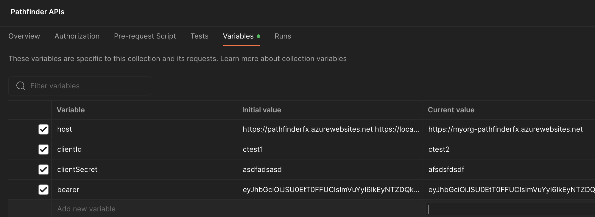
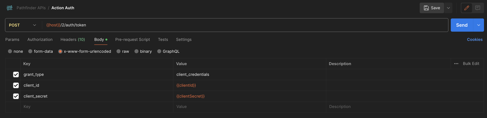
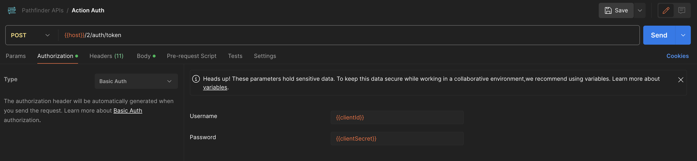
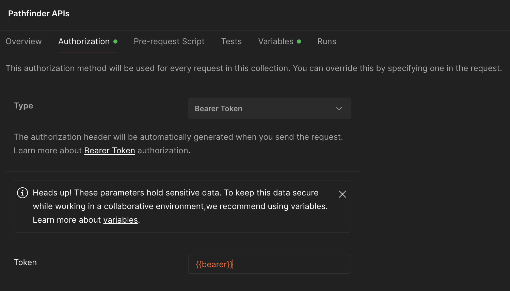
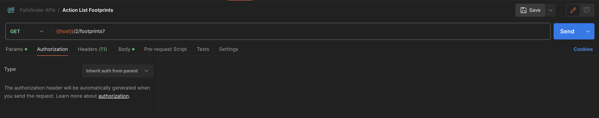

# Test your Pathfinder Host with Postman

You can use a rest client tool like [Postman](https://www.postman.com/) to test your Pathfinder Host. This guide will show you how to use Postman to test the Pathfinder Host. You can find the Postman collection in the [api](../api/) folder.

Import the Postman collection into Postman and follow the steps below to test the Pathfinder Host.

- Configure your Postman collection variables

    **Make sure you Save the collection after updating the variables**

- Get an access token:
  - Make sure that the variables are being used in the body of the `Action Auth` request. 
    - For `No Auth` requests,
    
    - For `Basic Auth` requests,
    
  - Copy the access token from the response and paste it to the `bearer` variable in the collection. Then set the collection's Authorization to `Bearer Token` and use the `bearer` variable.
  
- Test the Pathfinder Host:
  - Make sure that `Action List Footprints`, etc. are inheriting their Authorization from the parent collection.
  
  - Test each of the actions in the collection.
  