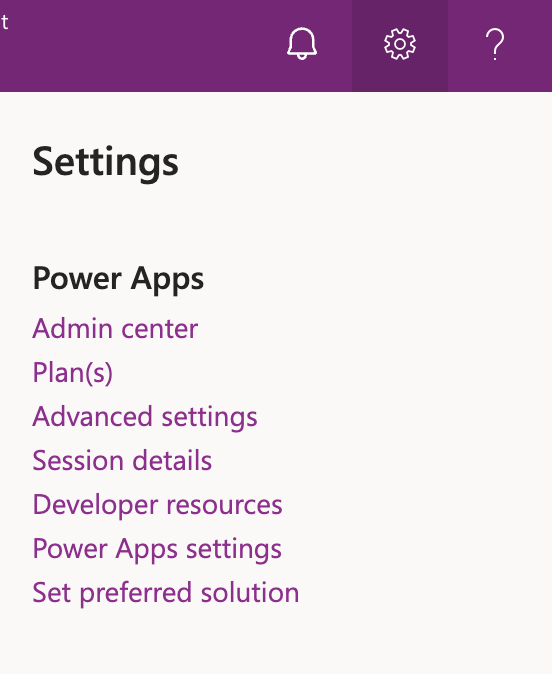

# Integration Harness Sample Application

This sample console application uses the `PathfinderFx.Integration` library to demonstrate how to use the library to request product footprints from a Pathfinder Host and then integrate these product footprints into [Sustainability Manager](https://www.microsoft.com/en-us/sustainability/microsoft-sustainability-manager).

## Getting Started

You will need to have [Sustainability Manager](https://www.microsoft.com/en-us/sustainability/microsoft-sustainability-manager) installed and configured to use this sample.  You will also need to have a Pathfinder Host that you can access to request product footprints from.

### Running the Integration Harness

1. Open the `IntegrationHarness` project in Visual Studio
2. Update the `appsettings.json` file with the appropriate values for your Sustainability Manager account you would like to test with.  

    ```json
        {
        "Password": "YOUR_PASSWORD",
        "Url": "https://YOUR_ORG.api.crm.dynamics.com/api/data/v9.2",
        "UserName": "YOUR_ID@YOUR_ORG.onmicrosoft.com"
        }
    ```

    - You can find the URL settings in Power Platform, Settings, Developer Resources, Web API Endpoint.
    

3. The `IntegrationHarness` requires arguments to be passed to it to run.  The arguments are the following:
    - --i: Initialize Pathfinder Configuration, this will create the necessary tables in the Dataverse to store the Pathfinder Configuration
    - --c: Clean Dataverse Tables of Footprints created via testing, this will remove all the footprints created by the Integration Harness
    - --h: Get Configured Pathfinder Hosts, this will return the list of hosts that have been configured in the Dataverse
    - --f: <HOST_NAME> Integrate Footprints from the specified host, this will request the footprints from the specified host and then integrate them into Sustainability Manager Dataverse tables

4. You can now build and run the console application either directly in [Visual Studio Code](https://code.visualstudio.com/) or from the command line using the following commands from the `src/IntegrationHarness` folder:

    ```bash
    dotnet build
    dotnet run
    ```
